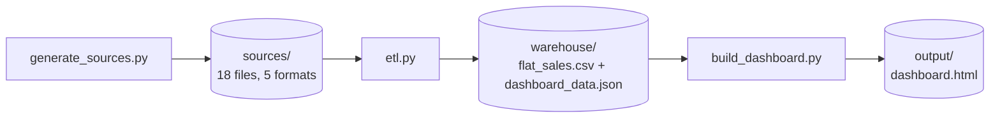
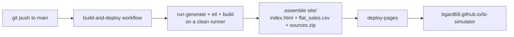

# Architecture

Three scripts, three directories, one static artifact at the end. Each stage
reads only what the previous stage wrote, so every stage can be rerun, diffed,
and understood in isolation.

The same three commands run locally and in CI. Because the generator is
seeded, both produce byte-identical data — the deployed site is a
reproducible build, not an upload.

## Stage 1 — `generate_sources.py` (the simulated world)

Fabricates a fictional outdoor-gear retailer ("Cobalt Outfitters",
Jan 2025 – Aug 2026) and exports it the way 18 separate systems would.
Everything derives from one seeded RNG (`random.seed(42)`), so every run
produces identical files.

The point is that the world has *causality*, not just random numbers:

- **Seasonality and growth** — order volume follows monthly factors
  (Nov/Dec peak, Q1 trough) on top of a +38% growth trend; product mix
  shifts by season (water sports in summer, apparel in winter).
- **Channel economics** — wholesale orders carry big quantities and 20–40%
  discounts; consumer orders are small with occasional promo discounts.
- **A quality causal chain** — 12% of shipments are late; late deliveries
  spawn "Shipping delay" tickets; footwear/apparel return at 2× the base
  rate; customers who experienced lateness or returns score lower on NPS.
  The dashboard's service-quality numbers are *consequences*, not dice rolls.
- **Realistic export quirks** — each system writes dates its own way
  (`2/13/2024`, `14-Mar-2026`, ISO), the CRM has messy region casing, the
  payment gateway lowercases currency codes. The ETL has to earn its joins.

## Stage 2 — `etl.py` (extract, conform, flatten)

A deliberately readable, stdlib-only pipeline in four movements:

1. **Extract** — one small parser per format: `csv.DictReader`, `json.load`,
   line-wise `json.loads` for JSONL, `sqlite3` for the ERP,
   `xml.etree.ElementTree` for the supplier price list. Each extract records
   itself into a lineage list that ends up rendered in the dashboard.
2. **Conform** — normalize region codes (strip/upper/map), parse each
   source's date format to ISO, uppercase currencies. Conformance runs
   *before* any join; skipping it wouldn't error, it would silently drop rows
   — which is exactly how real pipelines fail.
3. **Join onto the grain** — the ERP order line is the grain; every other
   source attaches to it via one of four patterns (see
   [docs/STAR_SCHEMA.md](docs/STAR_SCHEMA.md) for why each pattern exists):
   dimension lookups by ID, one-to-one event joins, aggregate-then-join for
   many-to-one sources, and composite-key reference lookups (FX by
   month+currency).
4. **Derive and load** — compute `revenue_usd`, `cost_usd`, `margin_usd`;
   drop cancelled orders; write the full 43-column `flat_sales.csv` plus a
   trimmed, compact JSON payload for the dashboard (column-legend +
   array-of-arrays, roughly half the size of keyed objects).

## Stage 3 — `build_dashboard.py` (the compiler)

Injects `dashboard_data.json` into `dashboard_template.html` at a
placeholder token and writes two variants: `output/dashboard.html`
(standalone page with doctype/head, what Pages serves) and
`output/artifact.html` (body-content variant for hosted-artifact
publishing). It also escapes `</` inside the JSON so embedded strings can
never terminate the `<script>` block.

## The dashboard itself

One self-contained HTML file — no CDNs, no chart libraries, no build step.

- **Data model**: the flat rows are embedded as a column legend plus
  arrays; index constants make the JS read like column access
  (`r[iRV]` = revenue).
- **Render loop**: a single `state` object (date preset + four dimension
  filters) drives everything. Every interaction recomputes aggregates from
  the raw rows and re-renders each SVG chart from scratch — at 7,858 rows
  this takes single-digit milliseconds, so there is no caching layer to get
  stale.
- **Cross-filtering, Power BI-style**: clicking a bar toggles a dimension
  filter. Each chart aggregates with its *own* dimension ignored, so the
  clicked chart keeps showing all members (selected in color, others
  dimmed) while every other visual, KPI, and table re-scopes.
- **Theming**: all colors are CSS custom properties defined three times —
  bare `:root` (light), a `prefers-color-scheme: dark` block guarded by
  `:not([data-theme="light"])`, and a `[data-theme="dark"]` block — so OS
  preference and an explicit host toggle both resolve correctly.
- **Accessibility**: every chart has a table-view twin, marks are
  keyboard-focusable with ARIA labels, tooltips appear on focus as well as
  hover, and in-segment label colors are picked by computed contrast.

## CI/CD

- **`build-and-deploy.yml`** — reruns the full pipeline from source on every
  push and deploys `output/` to GitHub Pages. Generated directories
  (`sources/`, `warehouse/`, `output/`) are gitignored: the repo holds only
  code, and the site is always the product of the committed code.
- **`codeql.yml`** — static analysis over the Python and the JavaScript
  embedded in the template, on push/PR and weekly.
- **No Dependabot** — there are no dependencies to monitor; the entire
  project runs on the Python standard library and hand-written JS.

## Design decisions

1. **Stdlib only.** Nothing to install anywhere — a laptop, a CI runner, or
   a reviewer's machine all run it identically. The absence of pandas is
   intentional: the joins are visible as plain dictionaries, which is the
   teaching point.
2. **Determinism over freshness.** A seeded world makes every rebuild
   reproducible and every screenshot re-creatable. (This is also why the
   scripts never call `datetime.now()` — the clock is pinned by config.)
3. **Conform before join.** All format normalization happens in one layer
   with counters, so the ETL can report exactly how much mess it fixed
   (111 region codes, 2 date formats, 1 casing bug).
4. **Aggregate before join.** Many-to-one sources (tickets, NPS, inventory)
   are collapsed to the grain *before* attaching — the classic defense
   against fan-out double-counting (explained in the star-schema doc).
5. **Flat table as the product.** A real Power BI model would keep the star;
   this project collapses it deliberately so the "what did the flatten
   actually do" story is inspectable in one CSV.
6. **Embedded data, static hosting.** Baking the JSON into the HTML trades
   ~1.3 MB of page weight for zero backend, zero CORS, zero hosting cost,
   and a dashboard that works from a file:// double-click.
