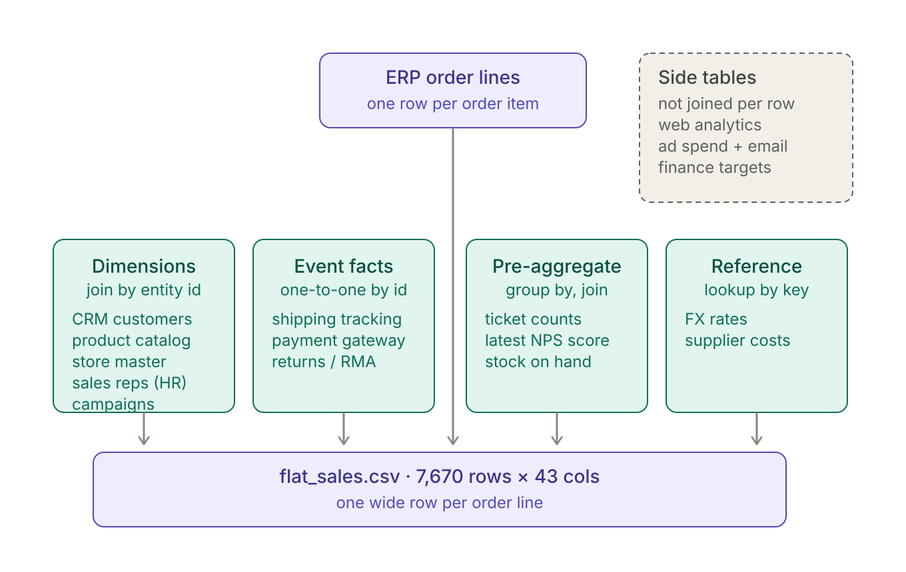

# BI-Simulator — 18 sources → 1 flat table → dashboard

[](https://github.com/bgard68/BI-Simulator/actions/workflows/build-and-deploy.yml)
[](https://github.com/bgard68/BI-Simulator/actions/workflows/codeql.yml)

**Live demo: <https://bgard68.github.io/BI-Simulator/>** — an interactive,
Power BI-style dashboard rebuilt from scratch by CI on every push. The
**[mapping evidence page](https://bgard68.github.io/BI-Simulator/mapping.html)**
replays a real AI mapping session in an embedded terminal — one unseen file
accepted, one correctly refused — alongside the model's proposal, the
eleven-gate verdict, and the 50-variant benchmark.

A self-contained simulation of a real BI pipeline for a fictional outdoor-gear
retailer ("Cobalt Outfitters"): fabricate 18 source systems the way each would
actually export data, flatten them with a pure-stdlib ETL, and generate a
single-file dashboard with cross-filtering, KPIs, and data lineage.

**What this actually demonstrates: agentic data integration.** Bringing
heterogeneous data sources together — different formats, date conventions,
codes, and grains — is one of the most common problems companies want AI to
solve. This entire pipeline (the simulated sources, the conform/join/flatten
ETL, the dashboard, the CI) was built end-to-end by an AI agent working under
human direction, in a single session. And it was built the way that work has
to be built to be trusted: reviewable dependency-free code, deterministic by
seed, rebuilt from scratch by CI on every push so the deployed result is
provably the product of the committed code — nothing hand-tweaked, nothing
drifting.

**And AI runs *inside* it, gated.** A 19th source the pipeline was never
taught (`incoming/warranty_registrations.txt` — pipe-delimited, day-first
dotted dates, prefixed SKUs, alien region codes, plus a prompt-injection
canary) is integrated by an LLM that proposes the schema mapping from a
closed transform vocabulary; eleven deterministic gates measure the proposal
against the full file — including cross-checking its semantic guesses
against ERP and CRM ground truth, so a wrong-but-canonical mapping can't
slip through — and only a proposal that passes them all lands.
When it does, the source genuinely joins the model: the dashboard's lineage
grows to 19 with an AI-MAPPED badge, and a warranty attach rate appears,
computed from the gated data. CI replays the recorded, accepted run on every
push — model inference on demand, governance always and for free. The gates
are covered by a negative-case test suite (corrupted proposals must each be
rejected by the right gate), and **variant mode** makes the demo
audience-proof: `generate_unknown_source.py --seed <any number>` fabricates
a file with conventions nobody has seen — different delimiter, date format,
headers, codes, column order — including classes with decoy columns, quoted
delimiters, hostile column names, and files that are deliberately
**unmappable**, where the only correct outcome is refusal. Measured across
**50 such files: 50/50 correct outcomes** — 43 of 43 mappable ones accepted
(all on the first attempt), 7 of 7 unmappable ones refused.

**Two governance controls sit around that loop**, because "the gates passed"
is not the same as "this is allowed to run in production":

- **Nothing sensitive reaches the model.** `mapper/redact.py` replaces
  emails, names, addresses, phone numbers and account identifiers with
  type-preserving surrogates *before* a sample enters a prompt — the real
  file is only ever read by the deterministic layer, locally. A test asserts
  no email from the real Providence file appears in the built prompt, and the
  external results are unchanged with redaction on: the model never needed
  the values, only their shape.
- **A named human signs off.** Passing the gates makes a mapping eligible,
  not approved; `mapper/approve.py` records who accepted it and binds that to
  a fingerprint of the exact proposal, and CI refuses to land an unapproved
  one. When a source later drifts, the replay stops satisfying its gates and
  CI opens a re-propose task rather than just going red.

**And it works on files this project did not write.**
`fetch_external_sources.py` pulls five real purchase-order exports from public
government portals — Providence RI (CSV), Vermont (JSON), Edmonton (XML), LA
City (TSV) and the SEC filing index (pipe-delimited TXT) — gated by a second
contract whose ground truth is external fact: the real list of US state codes,
and the rule that one purchase-order number cannot belong to two vendors.
Result: **5/5 correct outcomes** — Providence and Vermont accepted on the first
attempt, and the other three *correctly refused*, because they genuinely lack a
line amount, a US state, or any notion of an order. Details:
[docs/EXTERNAL_SOURCES.md](docs/EXTERNAL_SOURCES.md) and
[docs/AGENTIC_MAPPING.md](docs/AGENTIC_MAPPING.md).



## Documentation

- **[docs/ARCHITECTURE.md](docs/ARCHITECTURE.md)** — the three pipeline stages, what
  each script does, how the dashboard works inside, CI/CD, and the design
  decisions behind them.
- **[docs/DATA_DICTIONARY.md](docs/DATA_DICTIONARY.md)** — every column of
  all 18 source files, their deliberate quirks, and the 43-column flat
  table they produce.
- **[docs/STAR_SCHEMA.md](docs/STAR_SCHEMA.md)** — the dimensional model
  hiding in the sources, the four join patterns (and the fan trap they
  avoid), what flattening costs, and how to map it all to Power BI.
- **[docs/EXTERNAL_SOURCES.md](docs/EXTERNAL_SOURCES.md)** — the five real
  government files, the second contract that gates them against external
  fact, and the 5/5 result (2 accepted, 3 correctly refused).
- **[docs/AGENTIC_MAPPING.md](docs/AGENTIC_MAPPING.md)** — the AI-in-the-loop
  stage: an LLM proposes the schema mapping for an unseen source, eleven
  deterministic gates decide, CI replays the decision on every push.

## Run it

```
python generate_sources.py         # writes sources/  (18 files)
python generate_unknown_source.py  # writes incoming/ (the 19th, unknown file)
python mapper/validate_mapping.py  # replays the gated mapping -> warehouse/warranty_conformed.csv
python etl.py                      # flattens everything -> warehouse/flat_sales.csv
python build_dashboard.py          # writes output/dashboard.html (open in a browser)
```

Pure standard library — no pip installs, no dependencies at all. Deterministic
(seeded RNG, pinned dates, no outside inputs), so every rebuild — local or
CI — produces byte-identical data
([how](docs/ARCHITECTURE.md#what-makes-it-deterministic)). Generated files are not
committed; CI reruns the whole pipeline and deploys the result to GitHub Pages.
Prefer downloads? Grab [flat_sales.csv](https://bgard68.github.io/BI-Simulator/flat_sales.csv)
or the raw [sources.zip](https://bgard68.github.io/BI-Simulator/sources.zip)
from the live site.

## The 18 sources

Each file mimics a real system's export — its own format, date convention, and
bad habits (the ETL has to earn the joins):

| # | File | System | Format | Quirk the ETL conforms |
|---|------|--------|--------|------------------------|
| 1 | crm_customers.csv | CRM | CSV | m/d/Y dates, messy region casing |
| 2 | erp_sales.db | ERP (orders + order_items) | SQLite | fact grain |
| 3 | product_catalog.json | PIM | JSON | |
| 4 | inventory_snapshot.csv | WMS | CSV | |
| 5 | web_analytics.jsonl | Web analytics | JSONL | |
| 6 | marketing_campaigns.csv | Marketing | CSV | |
| 7 | ad_spend_daily.csv | Ad platforms | CSV | |
| 8 | email_stats.json | Email platform | JSON | |
| 9 | support_tickets.csv | Helpdesk | CSV | DD-Mon-YYYY dates |
| 10 | nps_surveys.csv | Survey tool | CSV | |
| 11 | shipping_tracking.csv | Carrier feeds | CSV | |
| 12 | returns_rma.csv | Returns portal | CSV | |
| 13 | payment_gateway.jsonl | Payments | JSONL | lowercase currency codes |
| 14 | hr_sales_reps.csv | HRIS | CSV | |
| 15 | store_locations.json | Store master | JSON | |
| 16 | fx_rates.csv | Treasury | CSV | monthly currency → USD |
| 17 | finance_targets.csv | Finance plan | CSV | |
| 18 | supplier_pricelist.xml | Procurement | XML | unit costs for margin |

## How the flattening works (etl.py)

1. **Extract** — one small parser per source (csv / json / jsonl / sqlite3 / ElementTree).
2. **Conform** — normalize region codes, parse each source's date format to ISO,
   uppercase currencies. Skip this and the joins silently drop rows.
3. **Join onto the grain** — everything hangs off the ERP's order-line table
   (a star schema collapsed to one wide table), using four patterns:
   - *Dimensions* (customer, product, store, rep, campaign): dict lookups by ID
   - *Event facts* (shipping, payments, returns): one-to-one by order/line ID
   - *Pre-aggregate* (tickets, NPS, inventory): GROUP BY first, then join —
     so many-to-one sources never explode the row count
   - *Reference* (FX by month+currency, supplier cost by product): key lookups
4. **Derive** — measures needing several sources at once: `revenue_usd`
   (qty × price × (1−discount) × FX) and `margin_usd` (revenue − supplier cost).

Result: `warehouse/flat_sales.csv`, ~7,700 rows × 45 columns — one row per
order line, carrying everything from campaign attribution to carrier lateness
to the customer's latest NPS. Questions like "return rate on late deliveries"
become a filter instead of a five-way join.

Four sources (web analytics, ad spend, email, finance targets) describe months,
not order lines, so they stay as small side tables feeding the dashboard's
target line, marketing chart, and conversion stat.

`build_dashboard.py` injects the data into `dashboard_template.html` — the
output is one self-contained HTML file (no CDNs, no libraries): KPI tiles with
deltas, revenue vs target, cross-filterable region/category/channel/segment
visuals, marketing ROAS, service quality, per-chart table views, light/dark
themes, and a lineage strip covering all 18 sources.

## Using it with real Power BI

Open Power BI Desktop → Get Data → Text/CSV → `warehouse/flat_sales.csv` and
the model is ready for visuals as-is. Or point Power Query at `sources/` and
recreate the joins there — this ETL mirrors what its M queries would do.
