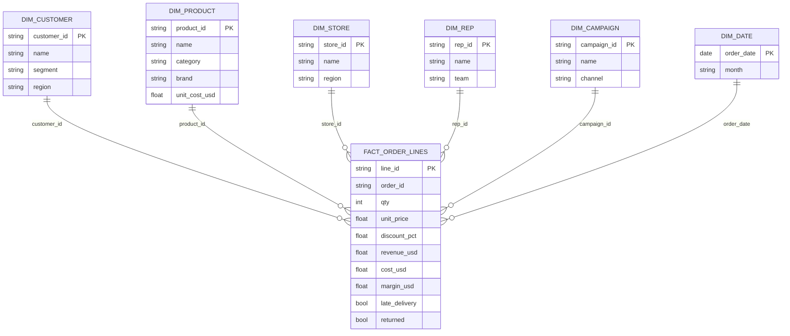

# The star schema — and how it collapses into one table

## The model hiding inside the 18 sources

A star schema is the standard shape for analytics data: one **fact table**
holding measurable events at a declared **grain**, surrounded by
**dimension tables** holding the descriptive context, joined by keys. The
"star" is the picture: fact in the middle, dimensions radiating outward.

This project's grain: **one row per product per order** (an order *line*).
Everything else either describes that line (dimensions), happened to it
(events), or summarizes to it (aggregates).

Notes on the cast:

- **Degenerate dimensions** — `order_id` and `line_id` live in the fact
  table with no dimension of their own; they exist purely to identify and
  group rows.
- **Enriched dimension** — `DIM_PRODUCT` is assembled from *two* sources:
  the PIM catalog (names, categories) and the procurement XML (unit cost).
  A dimension doesn't have to map 1:1 to a source system.
- **Role-collapsed date** — a real warehouse would have a proper date
  dimension (fiscal periods, holidays). Here `order_date`/`month` columns
  stand in for it.
- **Reference tables** — FX rates join by *(month, currency)*, a composite
  key that isn't an entity at all. Kimball would fold the result into the
  fact row as a measure — which is exactly what `revenue_usd` is.

## The four join patterns (and the traps they avoid)

| Pattern | Sources | Mechanics | The trap it avoids |
|---|---|---|---|
| Dimension lookup | CRM, PIM, stores, reps, campaigns | dict lookup by ID | — |
| One-to-one event | shipping, payments, returns | join by order / line id | payments: filter to the *captured* attempt first, or retried orders duplicate |
| **Aggregate, then join** | tickets, NPS, inventory | GROUP BY to the grain, then attach | the **fan trap** (below) |
| Reference lookup | FX, supplier costs | composite / entity key | converting at *today's* rate instead of the order month's |

### The fan trap, concretely

Order `SO10256` has 3 lines and 2 support tickets. Join tickets directly to
lines and you get 3 × 2 = 6 rows — revenue now sums to double the truth.
This is the classic *fan-out* failure, and it's silent: nothing errors, the
totals are just wrong.

The defense is to collapse the many-side to the fact's grain **before**
joining: `tickets_on_order = COUNT(tickets) GROUP BY order_id` produces one
value per order, which then attaches without multiplying rows. The same
logic gives `customer_nps` (latest survey per customer) and
`stock_on_hand` (sum across warehouses per product).

## Collapsing the star into `flat_sales.csv`

The ETL performs every join above and writes the result as one wide table —
the star, denormalized. Why do BI teams do this?

- **Simplicity** — one table means no relationship editor, no join
  ambiguity; every question is a filter + aggregate.
- **Portability** — a CSV imports anywhere: Power BI, a spreadsheet, a
  notebook, this repo's dashboard.
- **Speed at small scale** — 7,670 rows filter in microseconds; the
  duplication cost is irrelevant.

### What flattening costs

- **Duplication** — "Cobalt Halcyon -18C" is spelled out on every one of
  its lines. At warehouse scale this is real storage and refresh cost
  (columnar engines like Power BI's VertiPaq compress most of it away).
- **Grain traps for consumers** — order-level values (`tickets_on_order`)
  and snapshot values (`stock_on_hand`, `customer_nps`) repeat across
  lines; naive SUMs double-count. A star keeps those at their natural grain.
- **No history** — if a customer moves regions, a star with slowly changing
  dimensions can keep both versions; a flat rebuild overwrites the past.
- **Mixed grains stay out** — monthly sources (web traffic, ad spend,
  targets) can't be flattened onto order lines without lying, which is why
  they remain side tables.

Rule of thumb: **model as a star, deliver flat extracts** where a single
table genuinely serves the consumer — small models, exports, demos like
this one. This repo makes the transform explicit so you can see precisely
what the collapse does.

## Mapping this to Power BI

Two honest ways to use this dataset there:

1. **Import the flat table** — Get Data → Text/CSV →
   `warehouse/flat_sales.csv`. Model view shows one table; measures are
   direct: `Revenue = SUM(revenue_usd)`,
   `Return rate = DIVIDE(CALCULATE(COUNTROWS(t), t[returned]=TRUE), COUNTROWS(t))`,
   `Orders = DISTINCTCOUNT(order_id)` (note the dedupe — the grain trap
   again).
2. **Rebuild the star in Power Query** — load the 18 sources, reproduce
   `etl.py`'s conform steps as M transformations, keep dimensions separate,
   and relate them in model view. That is the Kimball-correct production
   shape; this repo's ETL is the same logic written where you can read it.
